||
|:-:|
|🎄 Advent calendar of 2018.This is a showreel using a React Hooks API.|

|SUN|MON|TUE|WED|THU|FRI|SAT|
|:-:|:-:|:-:|:-:|:-:|:-:|:-:|
|-|12/03|12/04|12/05|12/06|12/07|12/08|
|-||[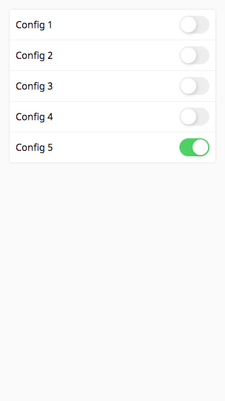](https://github.com/takefumi-yoshii/react-hooks-ogiri/tree/master/apps/toggle-switch)||[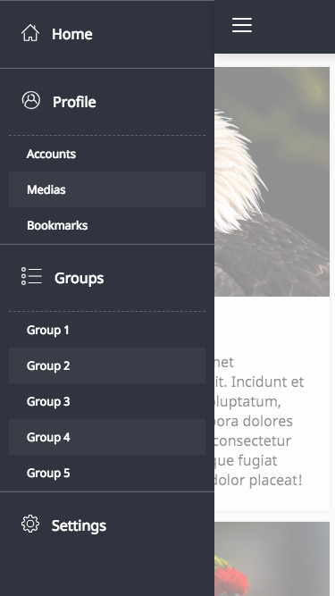](https://github.com/takefumi-yoshii/react-hooks-ogiri/tree/master/apps/drawer-menu)|[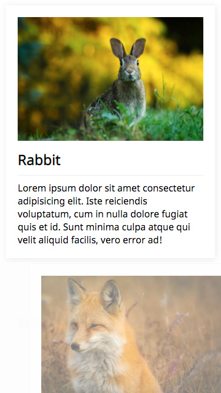](https://github.com/takefumi-yoshii/react-hooks-ogiri/tree/master/apps/pallalax-section)|[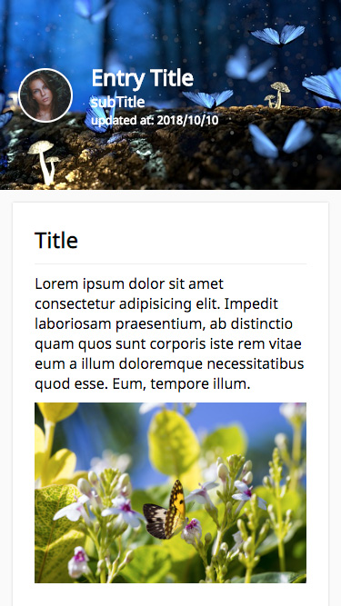](https://github.com/takefumi-yoshii/react-hooks-ogiri/tree/master/apps/pallalax-hero)|
|12/09|12/10|12/11|12/12|12/13|12/14|12/15|
|[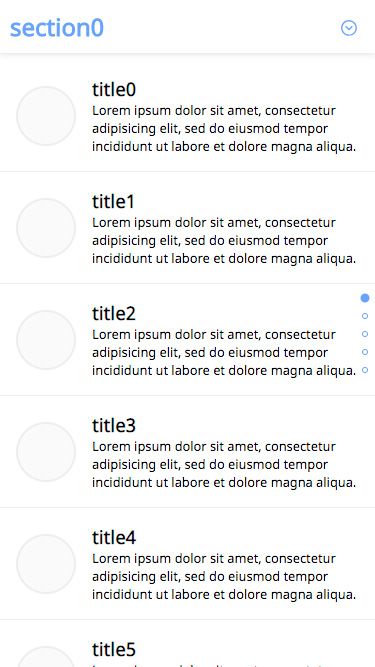](https://github.com/takefumi-yoshii/react-hooks-ogiri/tree/master/apps/stickey-effects)|[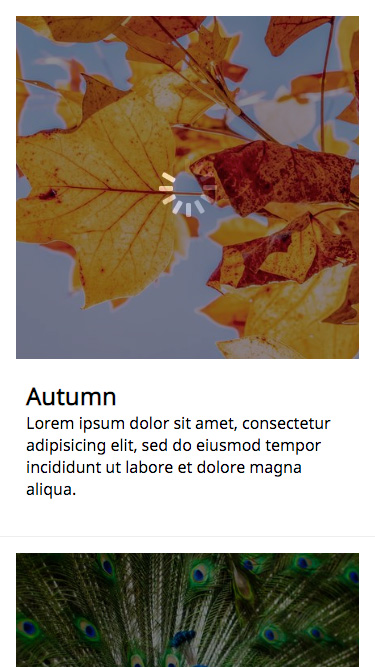](https://github.com/takefumi-yoshii/react-hooks-ogiri/tree/master/apps/stickey-image-loader)|[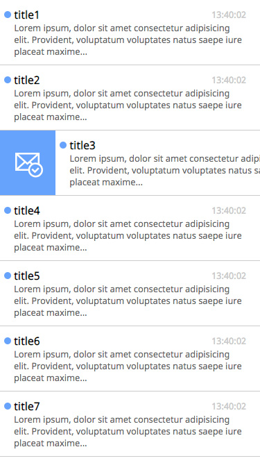](https://github.com/takefumi-yoshii/react-hooks-ogiri/tree/master/apps/swipe-item-opener)|[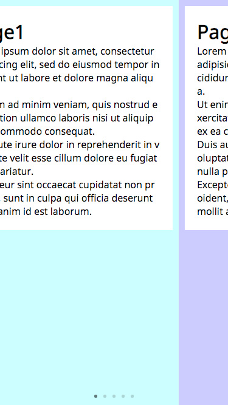](https://github.com/takefumi-yoshii/react-hooks-ogiri/tree/master/apps/swipe-pager)|[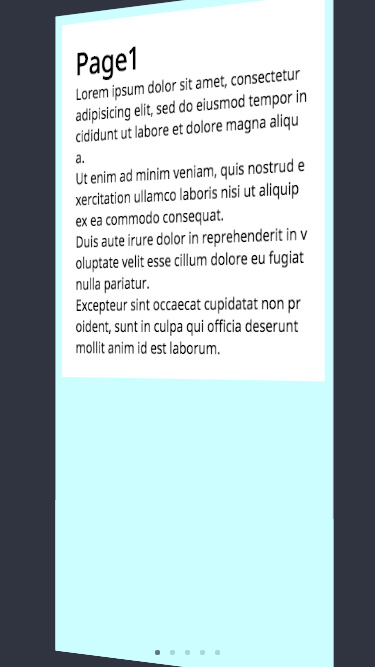](https://github.com/takefumi-yoshii/react-hooks-ogiri/tree/master/apps/swipe-flipper)|[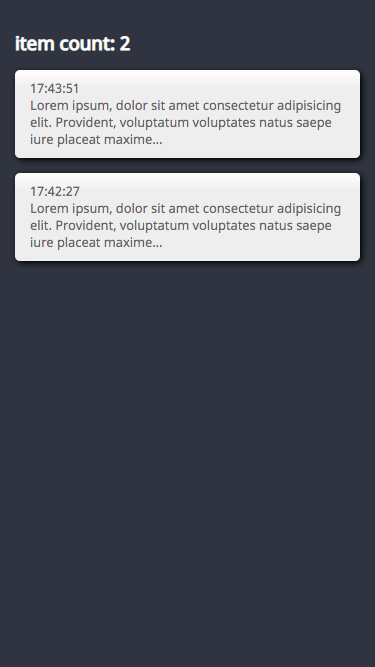](https://github.com/takefumi-yoshii/react-hooks-ogiri/tree/master/apps/pull-fetcher)|[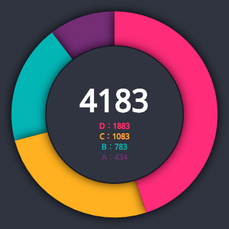](https://github.com/takefumi-yoshii/react-hooks-ogiri/tree/master/apps/pie-chart)|
|12/16|12/17|12/18|12/19|12/20|12/21|12/22|
||[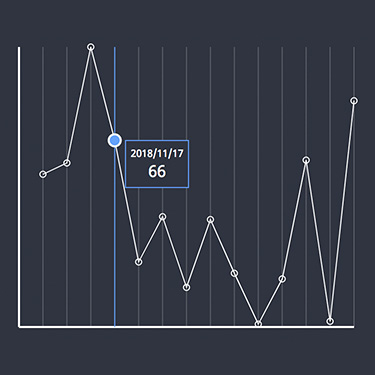](https://github.com/takefumi-yoshii/react-hooks-ogiri/tree/master/apps/line-chart)|[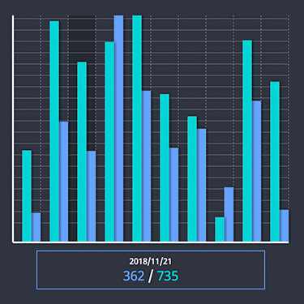](https://github.com/takefumi-yoshii/react-hooks-ogiri/tree/master/apps/bar-chart)|[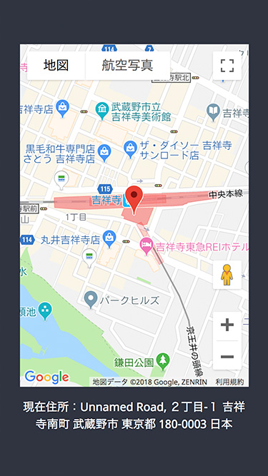](https://github.com/takefumi-yoshii/react-hooks-ogiri/tree/master/apps/google-map)|[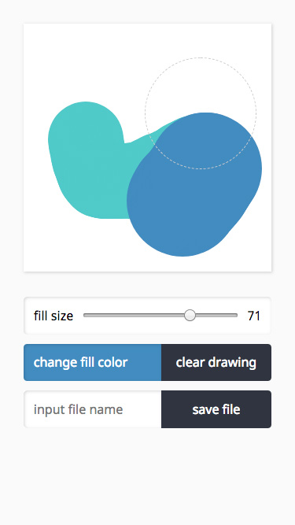](https://github.com/takefumi-yoshii/react-hooks-ogiri/tree/master/apps/canvas-painter)|[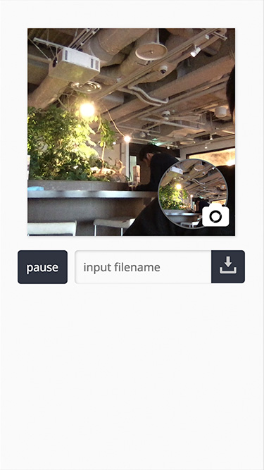](https://github.com/takefumi-yoshii/react-hooks-ogiri/tree/master/apps/camera-capture)|[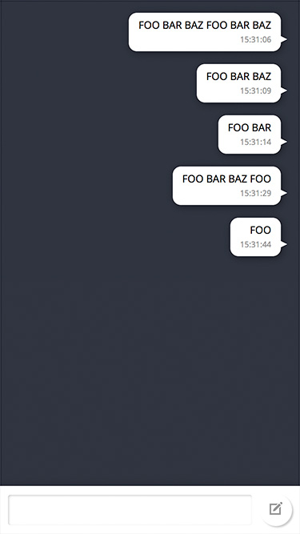](https://github.com/takefumi-yoshii/react-hooks-ogiri/tree/master/apps/chat-board)|
|12/23|12/24|12/25|spinoff|-|-|-|
|[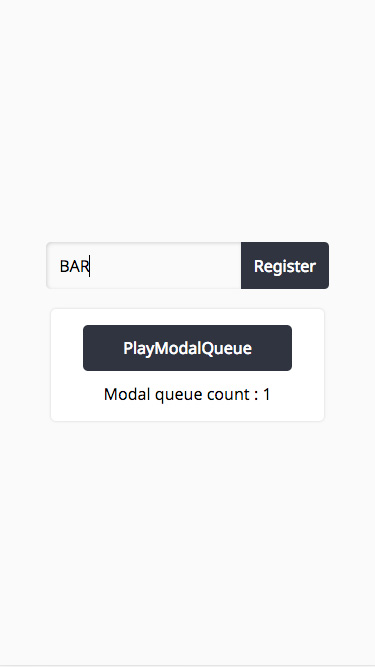](https://github.com/takefumi-yoshii/react-hooks-ogiri/tree/master/apps/modal-queue)|[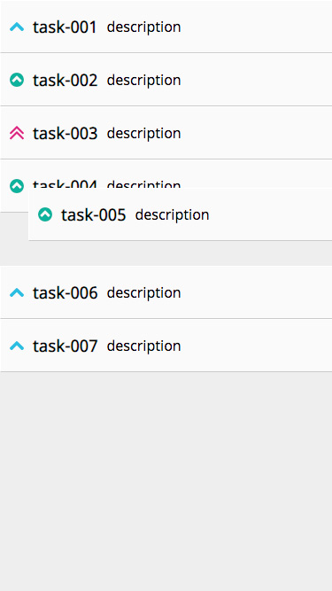](https://github.com/takefumi-yoshii/react-hooks-ogiri/tree/master/apps/drag-drop-section)|[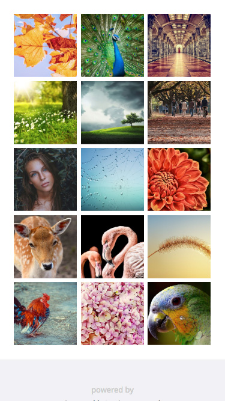](https://github.com/takefumi-yoshii/react-hooks-ogiri/tree/master/apps/photo-album)|[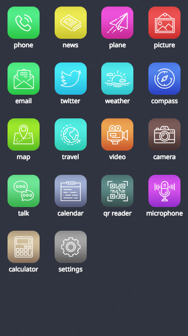](https://github.com/takefumi-yoshii/react-hooks-ogiri/tree/master/apps/icon-dashboard)|||

## Disclaimer

Rewriting the existing Statefull Component code to hooks is mentioned as deprecated. 
Also, it becomes a sample in the version that you can try today, destructive change may come in. 
Just checking the behavior of RFC as it is now.
Please make sure to check the information of each official every time as to whether it is a right usage method.
